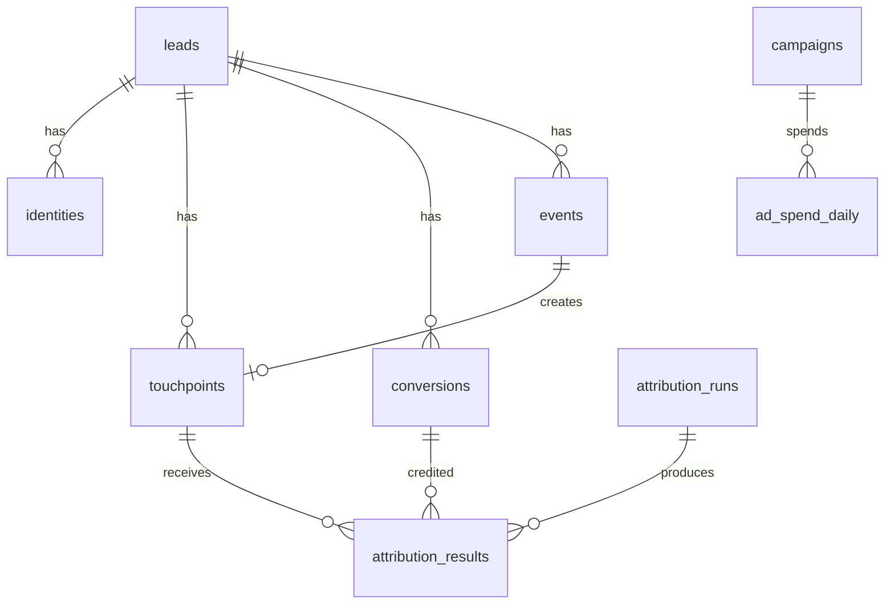

# Analytics Schema Reference

Schema: `analytics`  
Tenant key: `org_id` (Clerk Organization ID)

## Tables

### analytics.events

Normalized tracking events from Jitsu and direct ingest.

| Column | Type | Notes |
|--------|------|-------|
| id | UUID | PK, default gen_random_uuid() |
| org_id | TEXT | NOT NULL, tenant |
| anonymous_id | TEXT | Jitsu anonymous ID |
| user_id | TEXT | Known user ID |
| lead_id | UUID | FK → leads |
| session_id | TEXT | Session grouping |
| event_name | TEXT | NOT NULL (page_view, form_submit, etc.) |
| event_type | TEXT | page, track, identify, group |
| source | TEXT | ingest source (jitsu, api, csv) |
| url | TEXT | Page URL |
| referrer | TEXT | HTTP referrer |
| landing_page | TEXT | First page in session |
| utm_source | TEXT | |
| utm_medium | TEXT | |
| utm_campaign | TEXT | |
| utm_content | TEXT | |
| utm_term | TEXT | |
| gclid | TEXT | Google click ID |
| fbclid | TEXT | Meta click ID |
| ttclid | TEXT | TikTok click ID |
| msclkid | TEXT | Microsoft click ID |
| metadata | JSONB | default '{}' |
| message_id | TEXT | Idempotency key from Jitsu |
| occurred_at | TIMESTAMPTZ | NOT NULL |
| created_at | TIMESTAMPTZ | default now() |

**Indexes:** org_id, lead_id, anonymous_id, session_id, occurred_at, gclid, fbclid, ttclid, msclkid, (org_id, event_name), (org_id, occurred_at DESC)

---

### analytics.identities

Maps anonymous visitors to known leads.

| Column | Type |
|--------|------|
| id | UUID PK |
| org_id | TEXT NOT NULL |
| anonymous_id | TEXT NOT NULL |
| user_id | TEXT |
| lead_id | UUID FK → leads |
| linked_at | TIMESTAMPTZ |
| metadata | JSONB |

**Unique:** (org_id, anonymous_id)

---

### analytics.sessions

| Column | Type |
|--------|------|
| id | TEXT PK (session_id) |
| org_id | TEXT NOT NULL |
| anonymous_id | TEXT |
| lead_id | UUID |
| landing_page | TEXT |
| referrer | TEXT |
| utm_source/medium/campaign/content/term | TEXT |
| gclid/fbclid/ttclid/msclkid | TEXT |
| started_at | TIMESTAMPTZ |
| ended_at | TIMESTAMPTZ |
| event_count | INT default 0 |

---

### analytics.touchpoints

Marketing touchpoints used for attribution credit assignment.

| Column | Type |
|--------|------|
| id | UUID PK |
| org_id | TEXT NOT NULL |
| lead_id | UUID |
| anonymous_id | TEXT |
| session_id | TEXT |
| channel | TEXT |
| source | TEXT |
| medium | TEXT |
| campaign | TEXT |
| content | TEXT |
| term | TEXT |
| ad_platform | TEXT (google, meta, tiktok, microsoft, organic, direct) |
| ad_account_id | TEXT |
| campaign_id | TEXT |
| adset_id | TEXT |
| ad_id | TEXT |
| creative_id | TEXT |
| click_id | TEXT |
| click_id_type | TEXT (gclid, fbclid, etc.) |
| landing_page | TEXT |
| referrer | TEXT |
| event_id | UUID FK → events |
| occurred_at | TIMESTAMPTZ NOT NULL |

---

### analytics.leads

| Column | Type |
|--------|------|
| id | UUID PK |
| org_id | TEXT NOT NULL |
| email | TEXT |
| phone | TEXT |
| name | TEXT |
| anonymous_id | TEXT |
| first_seen_at | TIMESTAMPTZ |
| created_at | TIMESTAMPTZ |
| status | TEXT (new, contacted, booked, qualified, converted, lost) |
| utm_source/medium/campaign | TEXT |
| crm_id | TEXT |
| metadata | JSONB |

---

### analytics.conversions

| Column | Type |
|--------|------|
| id | UUID PK |
| org_id | TEXT NOT NULL |
| lead_id | UUID FK |
| conversion_type | TEXT (payment, deal_closed_won, subscription_started, etc.) |
| revenue_amount | NUMERIC(12,2) |
| currency | TEXT default 'USD' |
| status | TEXT (pending, completed, refunded) |
| payment_id | TEXT |
| crm_deal_id | TEXT |
| occurred_at | TIMESTAMPTZ NOT NULL |
| metadata | JSONB |

---

### analytics.ad_spend_daily

| Column | Type |
|--------|------|
| id | UUID PK |
| org_id | TEXT NOT NULL |
| platform | TEXT |
| ad_account_id | TEXT |
| campaign_id | TEXT |
| campaign_name | TEXT |
| adset_id | TEXT |
| adset_name | TEXT |
| ad_id | TEXT |
| ad_name | TEXT |
| spend | NUMERIC(12,2) |
| impressions | BIGINT |
| clicks | BIGINT |
| date | DATE NOT NULL |
| metadata | JSONB |

**Unique:** (org_id, platform, campaign_id, ad_id, date)

---

### analytics.attribution_runs

| Column | Type |
|--------|------|
| id | UUID PK |
| org_id | TEXT NOT NULL |
| model_name | TEXT (first_touch_v1, last_touch_v1, linear_v1) |
| lookback_days | INT |
| config | JSONB |
| status | TEXT (pending, running, completed, failed) |
| started_at | TIMESTAMPTZ |
| completed_at | TIMESTAMPTZ |
| error_message | TEXT |

---

### analytics.attribution_results

| Column | Type |
|--------|------|
| id | UUID PK |
| org_id | TEXT NOT NULL |
| run_id | UUID FK → attribution_runs |
| conversion_id | UUID FK |
| lead_id | UUID |
| touchpoint_id | UUID FK |
| model_name | TEXT |
| attributed_revenue | NUMERIC(12,2) |
| attribution_weight | NUMERIC(5,4) |
| source | TEXT |
| campaign | TEXT |
| ad_platform | TEXT |
| created_at | TIMESTAMPTZ |

---

### analytics.tracking_links

Dub-inspired trackable short links.

| Column | Type |
|--------|------|
| id | UUID PK |
| org_id | TEXT NOT NULL |
| slug | TEXT NOT NULL |
| destination_url | TEXT NOT NULL |
| utm_source/medium/campaign/content/term | TEXT |
| clicks | BIGINT default 0 |
| created_at | TIMESTAMPTZ |

**Unique:** (org_id, slug)

---

### analytics.sources / analytics.campaigns

Dimension tables for normalized source and campaign names.

---

### analytics.integrations

| Column | Type |
|--------|------|
| id | UUID PK |
| org_id | TEXT NOT NULL |
| integration_type | TEXT (jitsu, google_ads, meta_ads, stripe, ghl, etc.) |
| jitsu_workspace_id | TEXT |
| config | JSONB |
| status | TEXT |
| created_at | TIMESTAMPTZ |

---

## RLS Policies

All tables enable RLS. Policy pattern:

```sql
CREATE POLICY "org_isolation" ON analytics.events
  FOR ALL USING (org_id = coalesce(auth.jwt() ->> 'org_id', ''));
```

Service role key bypasses RLS for ingest API.

## Entity Relationship Diagram


